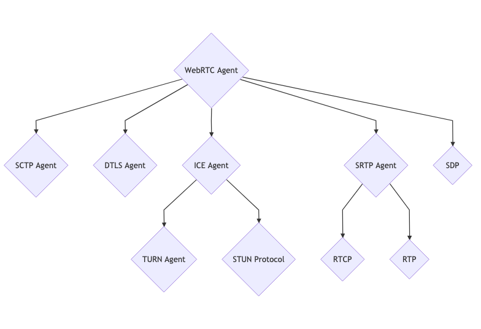

<!-- _class: title -->

###### WebRTC

# Demystifying WebRTC

Gaurav Agarwal

---

<!-- _class: speaker -->

###### Speaker

## Gaurav Agarwal

Software Engineer & Product Developer

Director of Engineering & Founder @ https://codermana.com

ex-Tarka Labs, ex-BrowserStack, ex-ThoughtWorks

---

<!-- _class: section -->

###### Start Here

# Why WebRTC

---

<!-- _class: quote -->

> HTTP and WebSockets are enough for **data**, but not enough by themselves for **good real-time media** like voice, video, or screen sharing.

---

<!-- _class: section -->

###### HTTP

# Why HTTP is not enough

---

HTTP is request/response.

---

That means:

* client asks, server responds
* each exchange is discrete

---

* it is not built for a continuous low-latency stream
* retries and buffering are usually favored over timeliness

---

<!-- _class: quote -->

> For media, **late data is often useless**.

---

<!-- _class: quote -->

> A video frame that arrives 2 seconds late is worse than a dropped frame.

---

HTTP is generally optimized for correctness and delivery, not “play it now or skip it.”

---

<!-- _class: section -->

###### WebSockets

# Why WebSockets are still not enough

---

WebSockets improve a lot over HTTP because they give you a persistent full-duplex connection.

---

That helps for signaling and live app events.

---

But raw WebSockets still miss several things real-time media needs.

---

<!-- _class: cards -->

# WebSockets miss media needs

| Transport | Timing | Session |
| --- | --- | --- |
| They usually run over TCP. TCP guarantees ordered delivery. Real-time media often prefers **UDP-like behavior** for actual media transport. | No built-in jitter handling or timing model. Media packets do not just need to arrive. They need to arrive with usable timing. | No standard support for audio/video codecs and negotiation. WebSockets are just a transport pipe. They do not define a media session model. |

---

<!-- _class: cards -->

# More gaps

| Connectivity | Congestion | Devices |
| --- | --- | --- |
| No NAT traversal solution. In real apps, two peers are often behind routers, firewalls, CGNAT, mobile networks, and enterprise networks. | No built-in congestion control tuned for live media. | No standard echo cancellation, A/V sync, device integration, etc. |

---

<!-- _class: section -->

###### Media Transport

# What real-time media usually needs instead

---

Real-time media needs a **media transport system**.

---

WebRTC adds the missing pieces:

* UDP-first transport
* RTP/RTCP style media handling
* jitter buffers
* packet loss recovery strategies
* congestion control
* codec negotiation
* NAT traversal via ICE/STUN/TURN
* encryption
* A/V synchronization
* browser and device support

---

<!-- _class: cards -->

# Where each tool fits

| HTTP | WebSockets | WebRTC |
| --- | --- | --- |
| **HTTP** is good for setup, APIs, downloading, buffered streaming. | **WebSockets** are good for signaling, chat, presence, control messages. | **WebRTC** is good for live audio/video/screen media. |

---

<!-- _class: section -->

###### Standards

# Understanding the RFCs

---

<!-- _class: image -->

## WebRTC RFCs

Content credits: https://webrtcforthecurious.com/docs/01-what-why-and-how/

---

<!-- _class: takeaway -->

# Resources

Code

https://github.com/CoderMana/presentation-demystifying-webrtc

Slides

https://demystifying-webrtc.slides.algogrit.com
